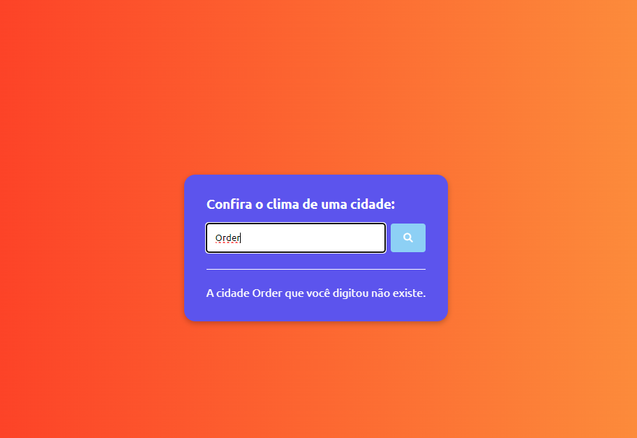

# Projeto-Clima-Agora
Projeto que utiliza uma API de clima para mostrar as condições climáticas da cidade solicitada.

## Descrição do Projeto
Projeto idealizado a partir das vídeo-aulas do Matheus Batistti com objetivo de colocar em prática meus conhecimentos de HTML, CSS e JavaScript.
O aplicativo realiza uma interação com a API do Open Weather Map para obter as condições climáticas do momento de acordo com a cidade informada. Foram necessários alguns ajustes pois a API da bandeira não estava mais disponível, então utilizei outro site que atualmente é funcional. O projeto também utiliza Font Awesome para ícones personalizados, Google Fonts API para usar a fonte Ubuntu e a API Unsplash para utilizar uma imagem de fundo de acordo com a cidade informada.
Esse projeto foi desenvolvido durante as aulas ministradas no SENAI.

## Tecnologias Utilizadas
* HTML
* CSS
* JavaScript
* Flags API
* Unsplash API
* Font Awesome CDN
* Google Fonts

## Layout do Projeto
**Tela Inicial** 

**Cidade Encontrada**

**Cidade não encontrada**

## Autor do Projeto
**Eduardo Hernandes** 
<a href="mailto:prof.eduardo.hernandes@gmail.com">prof.eduardo.hernandes@gmail.com</a>
